<div align="center">

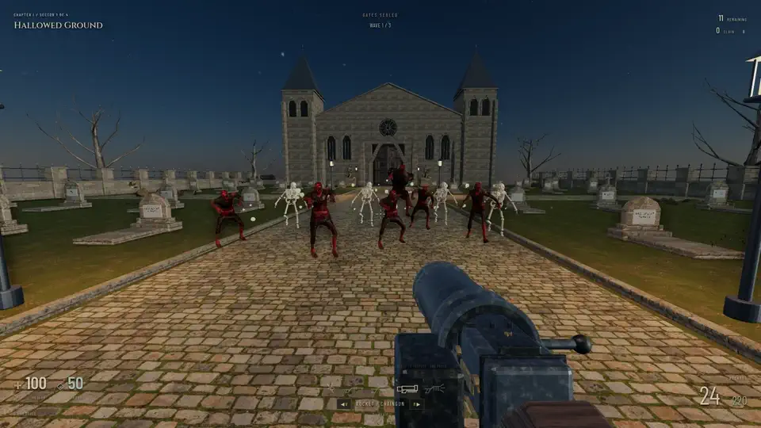

# PURGATORY

**A gothic arena shooter. Five weapons, ten fire modes, twenty-four levels of the damned, and no reloads.**

[](https://threejs.org)
[](https://www.typescriptlang.org)
[](https://rapier.rs)
[](https://www.electronjs.org)
[](https://github.com/nearbycoder/PainKiller/releases)
[](https://github.com/nearbycoder/PainKiller/releases/latest)

[**Watch the trailer**](#trailer) · [**Download**](https://github.com/nearbycoder/PainKiller/releases/latest) · [Features](#features) · [Build from source](#build-from-source)

</div>

> **An original homage.** Purgatory is an independent fan project inspired by the fast, crowd-clearing arena shooters of the early 2000s, Painkiller (2004) above all. It is not affiliated with, endorsed by, or derived from that game or its rights holders. All names, levels, code, models, sounds and music here are original or openly licensed; see [Credits](#credits-and-tooling).

## Trailer

<a href="docs/media/trailer.mp4">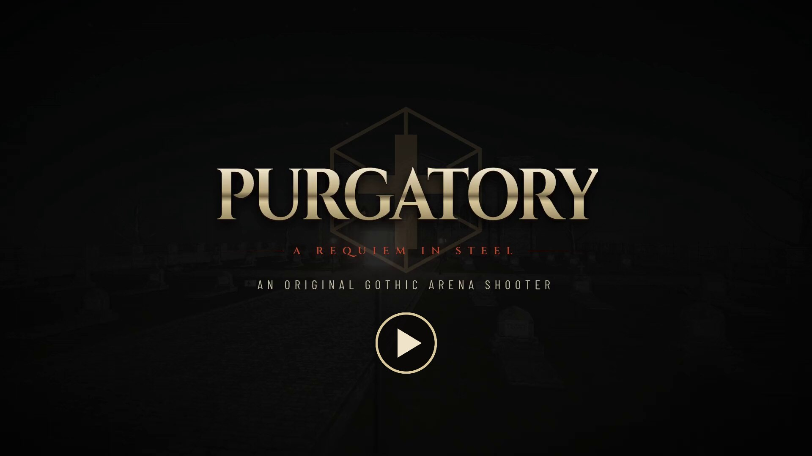</a>

_Feature trailer · 2:02 · 1080p · recorded on the **Ultra** graphics step · the game's own synthesized sound effects and chapter themes, no narration. Click the poster to open the [42 MB MP4](docs/media/trailer.mp4); GitHub serves it as a download. Every frame is the running game, scripted and rendered offscreen in virtual time by [`tools/make_trailer.py`](tools/make_trailer.py); only the captions and title cards are laid over it, in the game's own typefaces._

## About

You are a soul with a shotgun and nowhere left to go. Purgatory throws you into sealed arenas (a moonlit cemetery, a cathedral of ash, a soul-burning foundry, a drowned city, the Abyss itself) and opens the gate only when every wave of the damned is dead.

It is built around **momentum**: there is no reload key, every weapon has two fire modes, and the best tools are combinations: freeze an enemy then shatter it, shoot your own grenade with a stake to launch it, or fire both barrels of the Tempest to call down a storm. Every kill leaves a soul; gather 66 and you become the Wraith, invulnerable and four times as deadly for fifteen seconds.

It runs as an offline Linux desktop game, or in any WebGL 2 browser. No account, server, or internet connection is needed.

## Play it

Grab a build from [**Releases**](https://github.com/nearbycoder/PainKiller/releases/latest):

> **The published release is older than this page.** v0.1.0 (October 4, 2026, commit `4672978`) was built before the twelve rounds of improvements recorded in [docs/IMPROVEMENTS.md](docs/IMPROVEMENTS.md). It has three graphics quality buttons instead of the four-step Graphics fidelity slider, no bloom or colour grade, no key or controller rebinding, one music loop instead of five chapter themes, and no low-health warning, death recap, difficulty choice at the start of a campaign or mid-sector resume, among other things. The trailer and screenshots here show the current code. Until a new release is published, [build from source](#build-from-source) to play the game described on this page.

| Download                               | How to run                                                                                                                                                                                                                                                                                                                                                                                                                                         |
| -------------------------------------- | -------------------------------------------------------------------------------------------------------------------------------------------------------------------------------------------------------------------------------------------------------------------------------------------------------------------------------------------------------------------------------------------------------------------------------------------------- |
| `Purgatory-<version>-x86_64.AppImage`  | `chmod +x` it and run it. Without FUSE 2, run it with `--appimage-extract-and-run`.                                                                                                                                                                                                                                                                                                                                                                |
| `purgatory-<version>-linux-x64.tar.gz` | Extract it and run `./purgatory` inside. No installation is needed.                                                                                                                                                                                                                                                                                                                                                                                |
| `purgatory-<version>-web.zip`          | Serve the folder with any static file server (for example `npx serve` or `python3 -m http.server`) and open it in a WebGL 2 browser. Saves use local storage. The menu appears after about 50 MB of models, with a progress bar counted in megabytes and a _Try again_ button if a download fails; the cathedral, crypt and foundry scenes download in the background, and a level that needs one still in flight waits on a short loading screen. |

### System requirements

- **Desktop:** Linux x86-64 with a graphical desktop and WebGL 2 capable graphics drivers. The v0.1.0 downloads are 169 MB (AppImage) and 182 MB (tar.gz).
- **Browser:** any browser with WebGL 2. About 50 MB downloads before the menu (the v0.1.0 web zip is 45 MB).
- **Graphics:** aimed at mid-range desktop GPUs on the default Medium step, with Low for weak and integrated graphics. All four steps have been timed on one machine only, an AMD Radeon 8060S integrated GPU, where even Ultra draws a 1920 × 1080 frame in about 3 ms; no weak or older GPU has been tried.
- **Input:** keyboard and mouse, a standard-mapping controller, or touch.

The tested target is Linux x86-64 with a graphical desktop and WebGL 2 capable drivers. Windows and macOS builds have not been made or tested. The web build has been tested in Chromium (Electron and `chrome-headless-shell`) and in Firefox 157 on Linux (headless, on the GPU); Safari has not been tried. Desktop saves go to `~/.config/Purgatory/`, and the desktop window reopens at the size (and, where the desktop allows it, the position) it closed at, maximized or fullscreen if you left it so.

## How to play

Clear each **sector** by surviving three waves. Red arcs around the crosshair point to whatever just hurt you, a dashed arc warns of hellfire about to hit from off-screen, and when the last few enemies of a wave stay out of sight for a few seconds, chevrons at the screen edge point to them. When the gate turns green, walk into it and press **E**; while it is out of view, a green chevron at the screen edge points to it with its distance. Each level has 3–5 sectors; the last sector of a chapter ends with a **general**. Progress is saved as every wave begins: quit mid-sector and **Continue** resumes that wave with the health, armor, ammunition and souls you had when it started. Death restarts the sector with fresh supplies; the death screen names what killed you, lists what hurt you most in that attempt and says how that attack is avoided.

| Action                         | Keyboard & mouse                    | Controller (standard mapping) | Touch                             |
| ------------------------------ | ----------------------------------- | ----------------------------- | --------------------------------- |
| Move / look                    | WASD / mouse (arrow keys also turn) | Left stick / right stick      | Left joystick / drag on the right |
| Primary / alternate fire       | Left / right mouse (or Z / X)       | RT / LT                       | FIRE / ALT                        |
| Combo fire (Tempest storm orb) | Both mouse buttons                  | RT + LT                       | FIRE + ALT                        |
| Next / previous weapon         | R / V, mouse wheel, or 1–5          | RB / LB                       | ▶ / ◀                             |
| Jump (hold to hop)             | Space                               | A                             | JUMP                              |
| Sprint (hold, or toggle)       | Shift                               | Left-stick click              | RUN                               |
| Use the open gate              | E                                   | X                             | USE                               |
| Activate tarot card            | Q                                   | Y                             | TAROT                             |
| Inspect weapon                 | F                                   | B                             | INSPECT                           |
| Pause                          | Esc or P                            | Start                         | Ⅱ                                 |
| Fullscreen (desktop)           | F11                                 |                               |                                   |

These are the defaults. Every keyboard and mouse action can be rebound to any key or mouse button (including side buttons), two per action, under **Options › Controls**, and so can the controller's buttons, including the D-pad and Back, which are free by default and can pick weapons directly. Esc and Start always pause. The sticks move and look, and can be swapped for left-handed play; sprint can be held or toggled (a toggled sprint ends when you press it again or stop moving). The touch layout is fixed. Menus work with the mouse, arrow keys + Enter + Esc, or the D-pad + A/B, and the key line at the bottom of each menu names the controller's buttons while one is connected. If the browser will not give the mouse back when a paused fight resumes (Chromium refuses for about a second after Esc), the fight waits for a click instead of carrying on without it. Touch controls appear on touchscreen devices and when you touch the screen; moving or clicking the mouse brings back keyboard and mouse play, so a narrow browser window still aims with the mouse.

## Features

### Five weapons, ten fire modes, no reloads

|     | Weapon                       | Primary                 | Alternate                                  | Trick                                                                                                 |
| --- | ---------------------------- | ----------------------- | ------------------------------------------ | ----------------------------------------------------------------------------------------------------- |
| I   | **Thresher**                 | Rotating blades (melee) | Hurl the blade head; it returns            | Never runs out of ammunition                                                                          |
| II  | **Shotgun / Freezer**        | Ten-pellet scattershot  | Freezing bolt                              | Shotgun a frozen enemy to shatter it                                                                  |
| III | **Stake Launcher / Grenade** | Wooden stakes           | Bouncing grenades                          | Stakes ignite over distance and pin bodies to walls; shoot a stake into your own grenade to launch it |
| IV  | **Rocket / Chaingun**        | Rockets                 | Rotary chaingun                            | Blast impulses fling ragdolls                                                                         |
| V   | **Tempest**                  | Shuriken                | Chain lightning that leaps between targets | Fire both for a storm orb                                                                             |

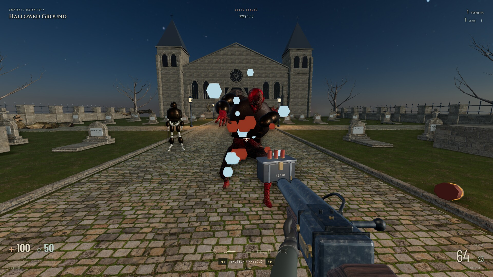

### Seven breeds of the damned, five generals

Shamblers, skeletons and **hounds** rush you; **monks** and floating **witches** throw hellfire from range; **knights** carry swords; **brutes** soak up punishment. Every melee attack winds up with an audible growl, panned toward the attacker, before it lands, so you can dodge it. Each chapter ends with a **general**: projectile volleys, rage phases at 70% and 35% health that summon reinforcements, and expanding shockwaves you have to jump.

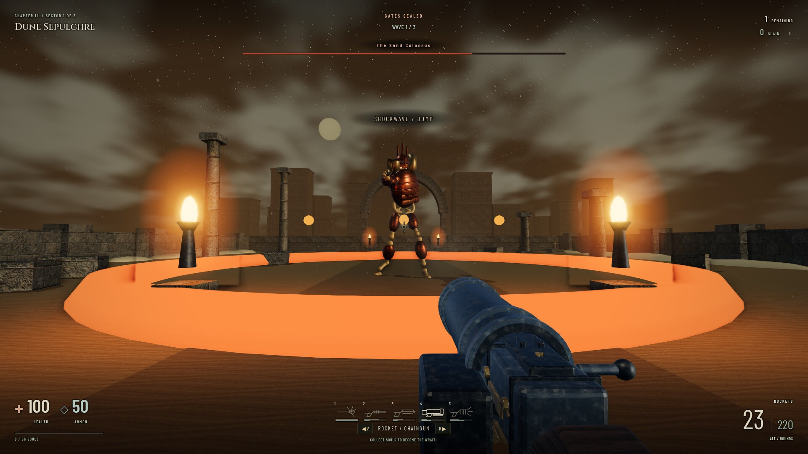

### Souls and the Wraith

Every kill drops a soul that drifts toward you and heals 1 HP. Collect **66** and you become the **Wraith** for 15 seconds: invulnerable, with quadruple damage.

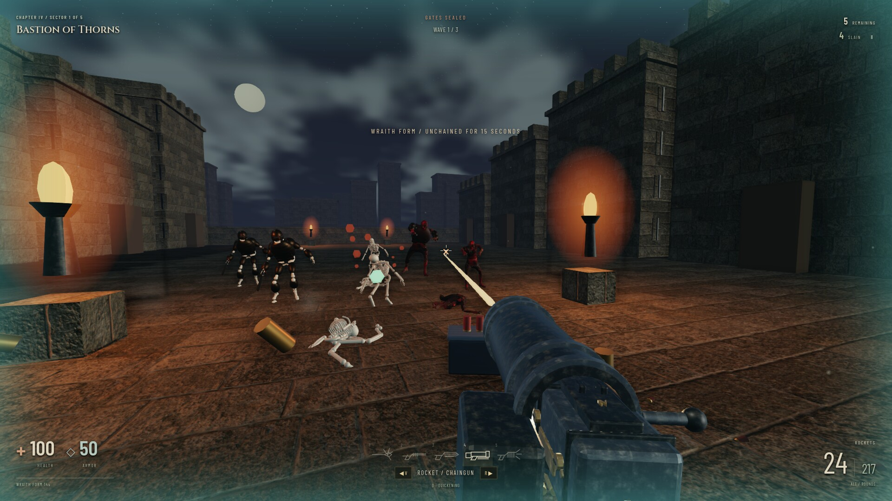

### Grave Tarot

Find a level's hidden relic or collect 25 souls there to earn that chapter's card; the pause screen shows how close you are, and the result screen names a card when you win it. Equip one of **Wrath** (double damage), **Quickening** (faster movement and firing) or **Bulwark** (ignore damage) under Grave tarot (your first card is equipped for you), then press **Q** once per sector for 30 seconds of power.

### Supplies, secrets and physics

Health, armor and ammunition sit in every arena and drop from the fallen. Every sector hides a relic. Corpses are articulated **Rapier** ragdolls. Explosions throw them, stakes carry them and can pin them to walls, and grenades bounce with real restitution.

### Graphics fidelity

One slider under **Options › Video** with four steps. Medium is the default; every step plays the same fight, only the picture changes.

| Step       | What it draws                                                                                                                                                                             |
| ---------- | ----------------------------------------------------------------------------------------------------------------------------------------------------------------------------------------- |
| **Low**    | No shadows, ambient occlusion or antialiasing; half the sparks and drifting motes; at most one rendered pixel per screen pixel. For weak and integrated graphics.                    |
| **Medium** | 1024-pixel sun shadows refreshed 30 times a second and FXAA antialiasing; up to 1.5× pixel density on HiDPI displays.                                                                     |
| **High**   | Bloom on lamps, fire, blasts and muzzle flashes, a colour grade and vignette, 2048-pixel shadows and half-resolution ambient occlusion.                                                     |
| **Ultra**  | Stronger bloom, 4096-pixel shadows refreshed every frame, full-resolution ambient occlusion, SMAA antialiasing, the sharpest texture filtering, denser particles and up to 2× pixel density. |

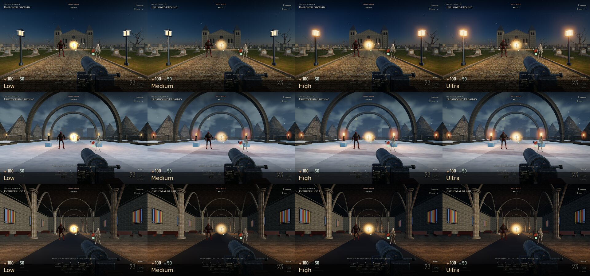

Render times for each step are in [docs/DEVELOPMENT.md](docs/DEVELOPMENT.md#graphics-fidelity-round-12).

### Options

- **Video:** Graphics fidelity, resolution scale with optional adaptive resolution, brightness, field of view, interface scale (75–150%) for the in-game HUD (reduced as far as a small window needs), an optional frame-rate readout (frames per second and the slowest frame of each second), and fullscreen (F11 on the desktop).
- **Audio:** master, sound effects and music volume, and the combat music on or off.
- **Controls:** look sensitivity (mouse and touch) and stick look speed set separately, stick dead zone (5–30%), a precise look response (slower near the centre, the same at full tilt), swapped sticks, hold or toggle sprint, controller vibration (when hit, near explosions, and as the Wraith wakes), inverted look on every input, and rebinding of every keyboard, mouse and controller action.
- **Gameplay:** difficulty (**Reverie**, **Purgatory** or **Torment**; a new campaign asks which one you want), camera bob, the crosshair in four styles, five colours and 75–200% size, switching weapons when one runs dry, the low-health warning and the one-time combat hints.

Firing a mode with no ammunition clicks and switches to the highest weapon that can still fire from that button (the Thresher never runs dry); the ammunition counter turns red when a reserve is low, and the weapon bar shows every weapon's two reserves and marks one with nothing left. One-time combat hints explain the weapon combos, souls and the tarot the first time each comes up, worded for keyboard, controller or touch. Arenas, gates and retries fade in from black, menus fade in, and buttons light up when pressed. Settings and campaign progress save locally, and _Restore all defaults_ asks before it resets anything.

### Accessibility

- Every keyboard, mouse and controller action can be rebound, two keys per action; the sticks can be swapped for left-handed play and sprint can be toggled instead of held.
- Danger is shown as well as heard: red arcs around the crosshair point to whatever hurt you, a dashed arc warns of hellfire from off-screen, and chevrons point to the last hidden enemies and to the open gate. Melee wind-ups and hellfire casts are stereo-panned toward the attacker.
- At a quarter of your health or less the health readout turns red and pulses, the screen edges darken red and a heartbeat plays, quickening as health falls; it can be turned off.
- The HUD sits on a soft edge shade with a dark halo, and its contrast against bright snow and sand was measured: small labels at least 3:1 and numbers and messages at least 4.5:1 in the views measured (see [Status](#status-and-known-issues)). The HUD scales from 75% to 150%, and the crosshair can change style, colour and size; each style is outlined so it reads on snow.
- Camera bob can be turned off (_Camera movement: Reduced_). With the system's reduced-motion setting on, menus fade in over 0.12 s instead of animating in, arena fades shorten to 0.3 s, and the pulsing of the incoming-fire arc and the low health readout stops.
- Menus work with the mouse, arrow keys + Enter + Esc, or the D-pad + A/B, and the key line at the bottom of each menu names the buttons for the input in use.
- The death screen names what killed you, lists what hurt you most in that attempt and says how that attack is avoided.

## Content

| Chapter                    | Levels                                                                                                        | Sectors |
| -------------------------- | ------------------------------------------------------------------------------------------------------------- | ------- |
| I · Ashes of the Faithful  | Hallowed Ground · Hall of Vigils · The Ossuary · Cathedral of Ash · The Barrow                                | 21      |
| II · The Hollow City       | Penitent Cells · The Silent Stage · Ward of Whispers · Frostbound Crossing · Lantern Parish · The Drowned Fen | 25      |
| III · Engines of Damnation | Last Platform · Soul Foundry · Dead Garrison · Dune Sepulchre                                                 | 17      |
| IV · Kingdom of Dust       | Bastion of Thorns · Gilded Court · Spire of Tongues · Weeping Wood · Seraph's Ascent                          | 22      |
| V · The Last Descent       | Sunken Canals · Black Harbor · Sealed Abbey · The Abyss                                                       | 19      |

That makes **24 levels, 104 sectors and 22 environment themes**, ending in a final confrontation and an ending screen. Each cleared level keeps a record of its fastest clear, most kills, whether its relic was found and whether it was ever cleared without dying. The result screen marks a new best time, and Select level shows the record. All levels are unlocked from the start in **Select level**. Choosing one moves your checkpoint but keeps your cards and records.

## Screenshots

|                                                                                                                |                                                                                                      |
| -------------------------------------------------------------------------------------------------------------- | ---------------------------------------------------------------------------------------------------- |
| 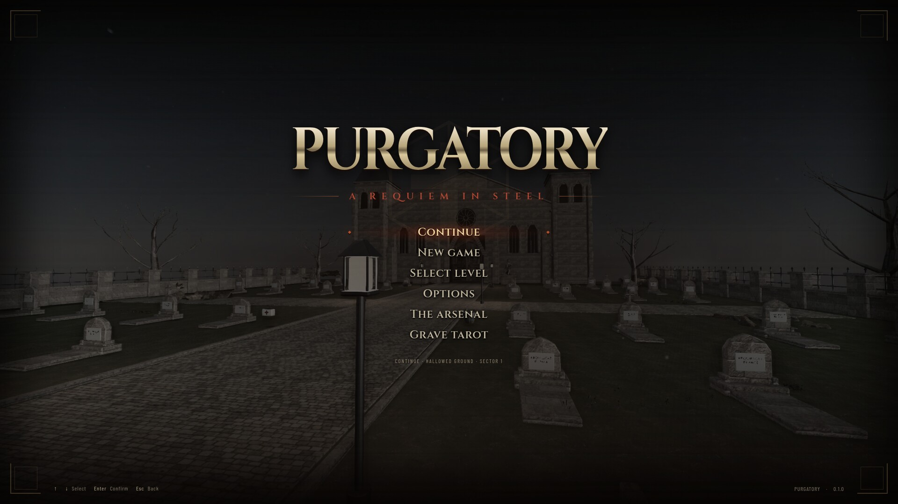                                 | 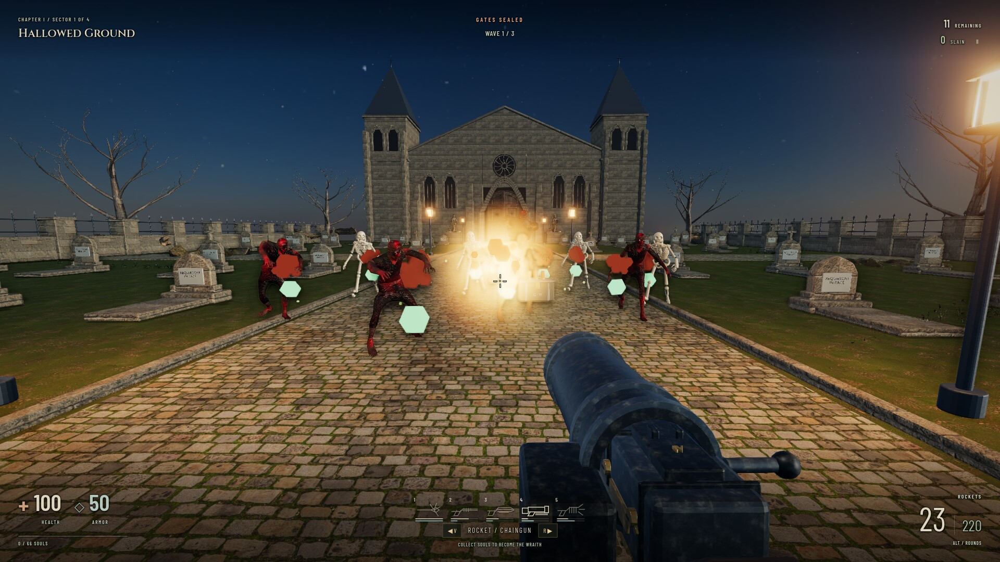 |
| 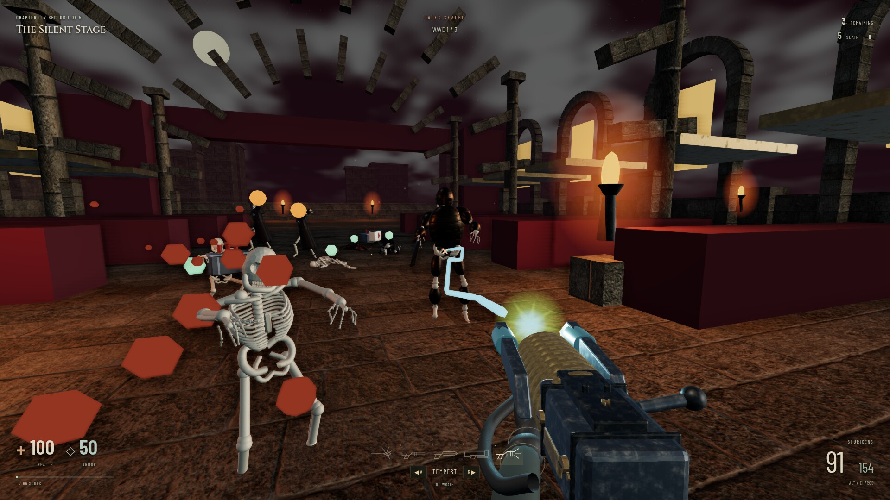 | 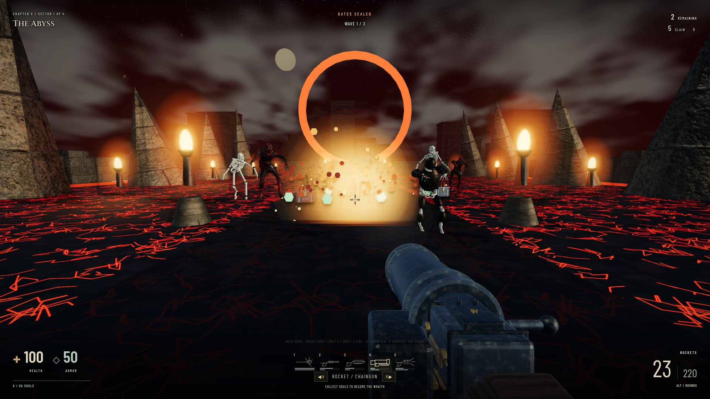                  |
| 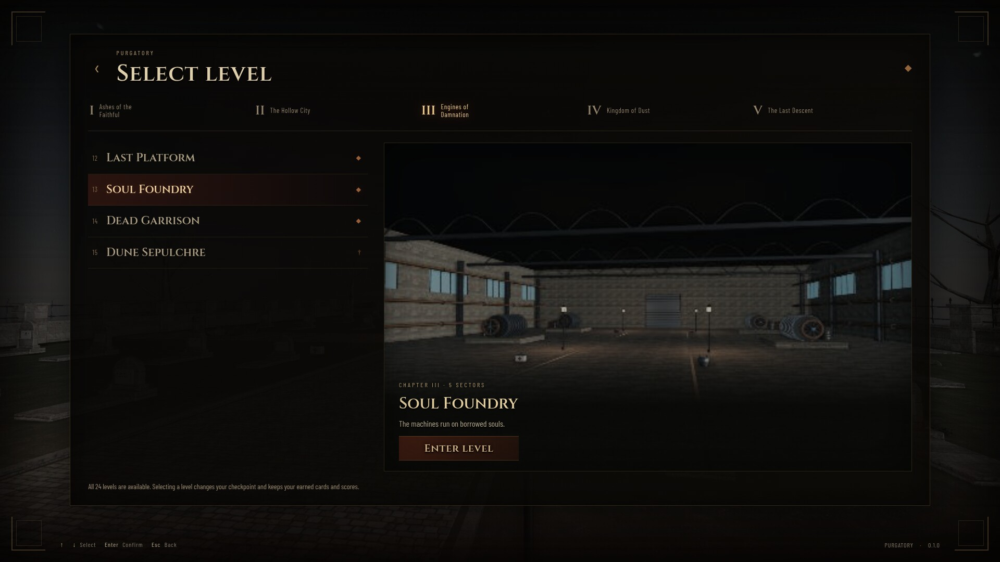         | 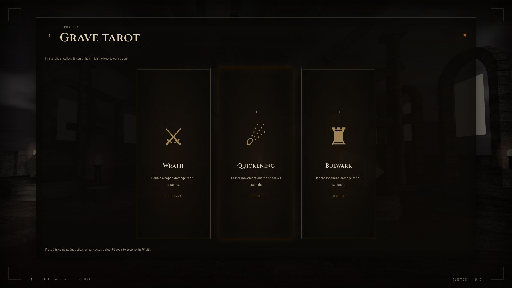                            |

## Build from source

Requirements: **Node.js 22+** (developed on Node 26), npm, and a WebGL 2 capable GPU. Blender **4.5 LTS** is needed only to rebuild the 3D art; ffmpeg and ImageMagick only for the trailer.

```bash
git clone https://github.com/nearbycoder/PainKiller.git && cd PainKiller
npm ci
npm run dev             # browser build with hot reload at http://localhost:5187
npm run build           # type-check + production bundle in dist/
npm run desktop         # run dist/ in the Electron desktop shell
npm run package:linux   # AppImage + portable tar.gz in release/
npm run package:web     # static site zip in release/ (purgatory-<version>-web.zip)
```

The web build is a plain static site (relative paths, no server code), so it can be hosted from any static host. `.github/workflows/pages.yml` can publish it to GitHub Pages, but it only runs when started by hand and needs Pages enabled for the repository first; nothing is hosted yet.

If npm's install-script policy skipped the Electron download, run `node node_modules/electron/install.js`. `./play.sh` runs a packaged build if one exists, otherwise it builds and launches the desktop shell.

**Tests and validators**

```bash
npm test                # Vitest unit, regression and exported-asset contract checks
npm run test:browser    # every tests/*-checks.js scenario in an offscreen Electron window
npm run test:desktop    # launches Electron: render, native save round trip, options, start a level
npm run test:desktop-window  # launches Electron twice: the window reopens at the size it closed at
npm run test:firefox    # the same scenario checks in the system Firefox (headless, throwaway profile)
npm run format:check    # Prettier
```

`tests/*-checks.js` are larger in-browser scenario scripts (every fire mode, freeze/shatter, death/retry, pickups, tarot, gates, every environment and boss, menus) that drive the `window.__PURGATORY__` development API. `npm run test:browser` starts its own dev server and runs them all; see [docs/DEVELOPMENT.md](docs/DEVELOPMENT.md).

**Regenerating the 3D art.** The runtime models in `public/assets/models/` are committed. Their editable Blender masters are generated by scripts rather than stored in git:

```bash
python3 tools/fetch-art.py   # download the CC0 sources (Poly Haven, OpenGameArt) into art/source/
npm run art:build            # Blender 4.5 headless: build masters, bake materials, export optimized GLBs
```

See [art/README.md](art/README.md) for what each script builds and the art that still needs work.

**Audio** has no source files to rebuild. Every sound effect and the music are synthesized at runtime with the Web Audio API in [`src/audio.ts`](src/audio.ts); the chapter themes are note data in [`src/music.ts`](src/music.ts).

**Level-select previews.** `npx electron tools/make-previews.cjs` renders `public/assets/previews/level-N.jpg` from the game: each level's first-sector start view, without HUD or weapon.

**Trailer, screenshots and teaser.** `python3 tools/make_trailer.py` starts its own dev server (`--port`, default 5199) and renders the scripted shots in [`tools/media/shots.js`](tools/media/shots.js) offscreen at 1920 × 1080 on the Ultra step, in virtual time and a throwaway browser profile, so every frame is identical on every run whatever the machine's load. It then replays the game's own synthesized sound effects in stereo, scores the cut with the chapter themes from `src/music.ts` (ducking under the effects), and writes the trailer, poster, teaser and README screenshots to `docs/media/`. Intermediate files and a quality-check contact sheet go to `captures/` (git-ignored).

## Project structure

```
src/
  game.ts            fixed-step simulation: player, weapons, projectiles, enemies, waves, progression
  world.ts           seeded procedural arenas: geometry, colliders, lighting, sky, material batching
  authored-world.ts  Blender-authored arenas with collision and lamp markers from glTF extras
  models.ts          enemy and weapon models; enemy-motion.ts / weapon-motion.ts animation layers
  physics.ts         Rapier ragdolls, grenades and stake pinning
  combat-effects.ts  muzzle flashes, smoke, impacts, explosions, shell casings
  audio.ts           synthesized sound effects; music.ts: chapter themes and their scheduling
  fidelity.ts        the four Graphics fidelity steps; grade.ts: colour grade and vignette
  ui.ts, style.css   menus, options, level select, tarot, HUD; controls.ts: gamepad + touch
  settings.ts        saved options; bindings.ts: keyboard, mouse and controller rebinding
  hints.ts           one-time combat hints; messages.ts: the HUD's message queue; recap.ts: death recap
  data.ts            campaign, chapters, weapons and tarot definitions; core.ts: pure combat/save logic
desktop/             Electron main process and narrow preload bridge (saves, fullscreen, quit)
public/assets/       runtime GLB models, HDR sky, level-select previews
tools/               Blender build scripts, asset fetcher, packaging, trailer pipeline (tools/media/)
tests/               Vitest suites and in-browser scenario checks
art/                 art pipeline notes and the CC0 asset manifest
docs/                development notes, the improvement log and README media
```

## Tech highlights

- **Fixed-step simulation.** Gameplay advances in 1/60 s steps decoupled from rendering, and draws from its own seeded random sequence that neither sound nor Three.js touches, so a seeded run replays exactly whatever the frame rate or the machine's load. Each frame draws the camera, enemies, projectiles and pickups between the last two steps, so motion stays even on 75, 120 or 144 Hz displays and through uneven frames. The same step function powers the development API used by the tests, the balance autopilot and the virtual-time trailer capture.
- **Hybrid physics.** Players and living enemies use fast swept-box collision against arena volumes. Death hands the current animated pose to a **Rapier 3D** ragdoll. Grenades are rigid bodies with continuous collision detection. Stakes ray-cast ahead of a flying corpse and pin the struck bone to static architecture with a spherical joint.
- **Rendering.** Three.js r180 PBR materials with an HDR sky and PCF soft shadows. A four-step Graphics fidelity slider scales the frame from a direct render with no post-processing (Low) to a composed one with SSAO, bloom fed only by what renders brighter than white, a display-space colour grade and vignette, and SMAA (Ultra), with shadow resolution and refresh rate, anisotropic filtering, particle density and pixel density following it. Extra and hidden particles draw from their own random sequence, so a seeded fight plays out identically at every step. Static meshes are merged by material, and an adaptive resolution controller kicks in under load. Arena loads fade in from black, and menu screens fade in.
- **Blender pipeline.** Every environment, weapon and enemy costume is built by headless Blender Python scripts. They handle procedural masonry, baked weapon materials, animation retargeting onto new rigs, LOD reduction, and texture-optimized GLB export.
- **Layered animation.** Six retargeted base clips are combined with procedural layers for breathing, turning, alternating attacks, casting, directional hit reactions and bone-mounted armor.
- **Zero audio files.** Gunfire, footsteps, pickups, enemy telegraphs and the music are oscillators and filtered noise generated in real time. Each chapter has its own combat theme, a four-bar phrase that thins to a drone while the next wave gathers and grows a layer while a general lives, scheduled ahead on the audio clock so its tempo never follows the frame rate. Enemy spawns, melee wind-ups, hellfire casts, deaths and the generals' roars and shockwaves are stereo-panned by bearing and attenuated by distance, under a shared voice budget.
- **Locked-down desktop shell.** The renderer is sandboxed with context isolation and no Node access. The preload exposes only save read/write, fullscreen and quit, and saves are written atomically.

## Credits and tooling

- **Libraries:** [Three.js](https://threejs.org) (MIT), [Rapier](https://rapier.rs) via `@dimforge/rapier3d-compat` (Apache-2.0), [Electron](https://www.electronjs.org) (MIT). Built with Vite, TypeScript, Vitest, Prettier and electron-builder.
- **Fonts:** [Cinzel](https://github.com/NDISCOVER/Cinzel) and [Barlow Condensed](https://github.com/jpt/barlow), SIL Open Font License 1.1, bundled through Fontsource.
- **CC0 art sources:** models, materials and the moonrise HDR sky from [Poly Haven](https://polyhaven.com), by Tina, Jenelle van Heerden, Rico Cilliers, Kless Gyzen, Benny Weimer, Rob Tuytel, Sơn Nguyễn, Amal Kumar, Dario Barresi, Dimitrios Savva, Greg Zaal and Jarod Guest. The [Male City Zombie](https://opengameart.org/content/male-city-zombie-ready-for-use-in-game-engines) model and animation clips are by Rikindle3D (OpenGameArt). The full list with links is in [art/ASSET_MANIFEST.json](art/ASSET_MANIFEST.json), and the license texts are in [THIRD_PARTY_NOTICES.txt](THIRD_PARTY_NOTICES.txt).
- **Original work:** game code, level layouts, weapon and environment modeling scripts, costumes, UI, synthesized audio, and all trailer media.
- **Tooling:** Blender 4.5 LTS, ffmpeg, ImageMagick. The development workflow follows OpenAI's [Building games with Astra](https://developers.openai.com/blog/how-to-build-games-with-astra) guide, and the game was built with AI coding agents.

Painkiller is a trademark of its respective owners and is mentioned here only to describe this project's inspiration.

## Status and known issues

Purgatory is a **playable prototype**. The whole campaign can be played start to finish, but it is not a finished commercial-quality game. The only published release is v0.1.0 from launch day, older than everything below (see [Play it](#play-it)); since then twelve rounds of fixes and features have landed on `main`, each with its plan, checks and results in [docs/IMPROVEMENTS.md](docs/IMPROVEMENTS.md).

- Four themes (cemetery, cathedral, crypt, foundry) use Blender-authored scenes. The other 18 are compact procedural arenas. Each has its own ground (snow, sand, tile, marble, planks, cobbles, lava-cracked basalt and more) and some dressing, but they are much plainer than the authored scenes, and sectors reuse each theme's layout with varied cover.
- The five generals share one rig and differ in attack patterns. Each has its own crown, antlers, horns, halo or wings, glowing eyes and colours, but these are pieces fixed to the shared skeleton, not bespoke models, and the colour differences are subtle under torchlight. The hound is procedural, and the humanoid enemies reuse two base rigs with costume variants.
- Campaign length and balance have not been measured end to end with human playtesters. A scripted autopilot ([docs/DEVELOPMENT.md](docs/DEVELOPMENT.md#balance-autopilot)) samples ten sectors on every difficulty and has played all 104 sectors on Purgatory without getting stuck (it dies only at two generals); since round 5 its runs are reproducible. For it, ordinary sectors are easy even on Torment and the generals, especially their shockwaves, cause most deaths. A bot is not a player, though.
- Controller and touch input are tested only with synthetic events; no physical gamepad or phone has been tried, so controller vibration, the stick dead zone, the precise look response, swapped sticks and toggle sprint have never been felt. Switching between the touch layout and the mouse (round 9) is checked with synthetic touches and Chromium's touch emulation, not on a real touchscreen laptop or tablet.
- The sound is measured, not heard: levels of the empty-weapon click, the five chapter music themes (round 6) and the low-health heartbeat (round 7) were checked by offline rendering, and listening clips are in `docs/media/improvements/`, but no person has listened to them yet.
- Only Linux x86-64 desktop builds are produced. Windows and macOS packaging is untested.
- The web build is packaged (`npm run package:web`) but not hosted anywhere yet. A manual-only GitHub Pages workflow is included and has never been run. It passes the automated checks in Chromium and in Firefox (headless, on Linux), but no one has played it by hand in Firefox, and Safari has not been tried.
- Two round 8 behaviours are checked against simulated platform responses only. Holding the fight when the browser refuses the mouse is tested with a simulated pointer lock, since the offscreen test windows never get one and the shared desktop's mouse must not be grabbed. Reopening the desktop window maximized, fullscreen or at its old position is covered by unit tests only, because this Wayland desktop reports no window position and test windows must not cover the shared desktop; reopening at the old size was checked by launching the build twice.
- The HUD's contrast over bright ground was measured at 1280 × 800 from each level's opening view (round 9), at eight headings in the three brightest arenas and a dark hall (round 10), and looking down at the ground, beside a rocket blast and in the chaingun's muzzle flash, with the mid-screen messages on screen (round 11): every small label at least 3:1, every number and message at least 4.5:1 there. Round 12 measured a crowded fight (a dozen enemies in front, firing), Wraith form and the low-health vignette in Frostbound Crossing and Hallowed Ground: everything held those targets except the health readout at low health, which faded to 1.6:1 at the low point of its pulse and now brightens instead (4.7:1 or more). Bloom and the vignette on High and Ultra left no small label under 3:1. These are still frozen frames; nobody has judged them in play.
- Keyboard, mouse and controller buttons can be rebound and the sticks swapped; the touch layout is fixed. Saves resume the start of the current wave, not the exact moment you quit. After the campaign's ending the title screen still offers _Continue · The Abyss · Sector 1_, which replays the last level; nothing marks the campaign as finished there yet.
- The rendering quality and performance target is mid-range desktop GPUs. There is no published benchmark, though an optional readout (Options › Video) shows the frame rate. The Graphics fidelity steps were timed on one machine only (an AMD Radeon 8060S integrated GPU, where every step renders the measured scenes in a few milliseconds even at 1920 × 1080 and at 2× pixel density; [docs/DEVELOPMENT.md](docs/DEVELOPMENT.md#graphics-fidelity-round-12)); no weak or older GPU has been tried, so whether Low is smooth on one is untested. High's and Ultra's bloom, colour grade and vignette (round 12) were tuned from still screenshots of three arenas; nobody has played with them on, and they may wash out or darken arenas that were not looked at. Motion between simulation steps is checked with synthetic frame timing at 60–144 Hz; nobody has looked at it on a real 120 or 144 Hz display. Shaders are compiled ahead of the fight, so the first title screen after launch holds one frame for about half a second, and starting a level holds about half a second.

No open-source license has been chosen yet, so the code is all rights reserved by default for now. The third-party components keep their own licenses as listed above.

Ideas, bug reports and pull requests are welcome.
